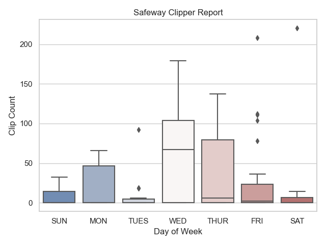

# Safeway Coupon Clipper

A simple tool to clip Safeway grocery coupons!

---

## Switch to the Firfox Gecko Driver

Originally this project used the Chrome Webdriver for Selenium instances. Given chromes updates, and fighting toggleing auto update off constantly, I have migrated to using the Gecko Driver with Firefox. The minimum verion of Gecko Driver is 26.

That said, using the `-driver chrome` argument will use the Chrome webdriver. This was lasted tested using Chrome Driver version 79.

- The latest Chrome Driver can be downloaded from [Chromium](https://chromedriver.chromium.org)
- The latest Gecko Driver can be downloaded from the [Mozilla GitHub](https://github.com/mozilla/geckodriver/releases)

Once downloaded, place the Gecko Driver or Chrome Driver in the `./webdrivers/` directory. Format the name as `geckodriver_##`

Alternatively you can modify the `get_webdriver()` function in `clipper.py` to point to the location you have chosen.

---

## Help Optimizing Cron Jobs

I have traditionally run `clipper.py` on a cron, or manually _when/if_ I remember to do so. To help not spam the Safeway website with my login and coupon checks, I allowed a cron to run the `clipper.py` script at 2am, 4am, 6am, 2pm, and 8pm every day for nearly two months while collecting clip counts.

If you do the same (for a longer or shorter period of time optionally) you can then run the `reporter.py` script to generate a chart similar to this one:

This is a Box and Whisker plot chart that helped me realize that Wednesdays are the best day to run the `clipper.py` script with Friday mornings (My routine shopping day) as a second pass.

---

## Requirements

Running `clipper.py` will require a web driver (see above), and I reccomend using the `python -m pip install -f requirements.txt` command to install the needed packages.

Running `reporter.py` will require at least one data file, more the better, and will require using the the `python -m pip install -f requirements_reporter.txt` command to install the needed packages.
